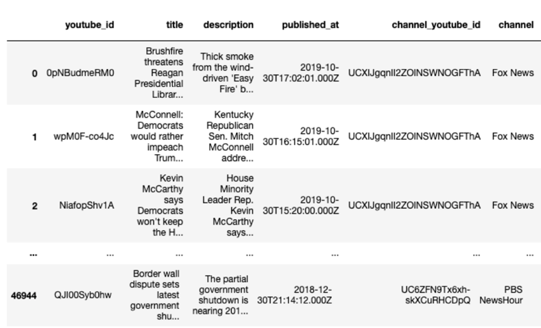

# US-views-world

This is my capstone project proposal.

## Project

How the US views other countries: Sentiment analysis on YouTube

## Motivation

I have been in the US since 2014. As one of the international students, I pay close attention to foreign relations between the US and other countries. Mainly, I follow news topics of China-US relations. I start to develop my sense of the relationship between these two countries. US and China have been in an extensive economic partnership over the years. Since the last year, the relations deteriorated with the beginning of the US-China trade war. I also heard from my friends from different countries talk about their sense of global relationships. So I think it would be interesting to find objective ways to measure international relations between the US and other countries and look at how it evolves over the years, from Obama's presidency to Trump's presidency.

## Data source

For this study, I use the videos posted on YouTube by 11 American news channels. The channels considered for this study are shown below.

I pulled the video metadata for all 11 channels from the [YouTube Data API Version 3](https://developers.google.com/youtube/v3/getting-started). Due to the 10,000 quota unit limitation per day, I acquired 46,945 metadata in total. A more significant number of data could be obtained in the future by requesting a higher quota for this project. The collected metadata comprised the following information: YouTube ID, video title, video description, published date, channel ID, and channel name, as shown below.

In this study, I am interested in international relations between the US and the other 30 countries. The selected countries are listed below.

The relevant videos are extracted from the video metadata via selecting the videos with the title mentioning those countries. The percentage relevancy for each channel is shown below. We can see that RT covers more international topics than the other channels, while AP is focused more on different topics. 

The total number of relevant videos is 5298. The relevant videos cover about 11% of all videos published by the selected channels in 2019. I would say acquiring more data will be necessary. But due to the current limitation of quota, I will demo the study with the data I have.

## Method

To quantitative measure the US media's attitude as positive, negative, or neural, sentiment analysis is applied to the relevant videos. In this project, I performed the sentiment analysis of all 5298 videos through the [Google Cloud Natural Language API](https://cloud.google.com/natural-language/docs/sentiment-tutorial). The `analyzeSentiment` method was used to analyze the input text and understand the emotional opinion of the input text. The output is a score within a range of -1 to 1, where -1 signifies 100% negative emotion, 1 signifies 100% positive emotion and 0 signifies neutral. An example of the score for ten videos is shown below.

Let's take a look at the distribution of the sentiment scores, as shown below. The majority of the sentiment score is zero. It indicates most of the videos posted by the US media send out a neutral attitude.

## Plot

The total number of videos posted from all 11 US media channels in 2019 is visualized in the world map. Different colors in the countries represent a different number of videos associated with that country. The visualization result shows three levels of attention from US media.
 - First level: Russian gains the most attention of US media with a total of 903 videos.
 - Second level: Iran (674 videos) and China (633 videos) also receive substantial attention from US media, compared to the countries in purple.
 - Third level: US media also closely follow the things that happened in Syria (441) and North Korean (331).
 

[Interactive mode](https://nbviewer.jupyter.org/github/HaominIsMe/US-views-world/blob/master/plot_attention.ipynb)

I also visualize the averaged sentiment score based on the results of sentiment analysis. Different color in different countries represents the average sentiment score based on videos posted by US media channels. 
 - The sentiment score is in the range from -0.15 to 0.06. It indicates the US media overall neutral to other countries.
 - North Korean receives relatively higher sentiment score than other countries. 
 - Sudan receives the lowest sentiment score.

[Interactive mode](https://nbviewer.jupyter.org/github/HaominIsMe/US-views-world/blob/master/plot_sentiment.ipynb)

# Next

This demo explores the question of how US views other countries based on sentiment analysis of videos posted by US media channels. Given this demo, there are many possibilities to extend it to answer other interesting questions. For example, we could pull more metadata and see how the attention and sentiment maps evolve from Obama administration to current Triumph administration.

# Run

- First paste your [API key](https://cloud.google.com/docs/authentication/api-keys) in `google-api-key.txt`

- To pull the meta data and download the sentiment analysis results, run

  `python main.py`

  It will generate 15 .cvs files

  `videos-<channel name>.csv` : video metadata for each channel.

  `videos-MERGED.csv`: merges all `videos-<channel name>.csv` files.

  `videos-relevant.csv`: contains videos relevant to the topics.

  `sentiment.csv`: contains sentiment scores analyzed through Google Cloud Natural Language API.

  `videos.csv`: contains all relevant videos and their sentiment score. 

- To plot the results, use `plot_attention.ipynb` and `plot_entiment.ipynb`

